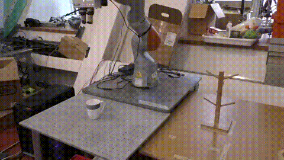

# kPAM: Generalizable Robotic Manipulation

This project aims at pose-aware robotic manipulation for a category of objects. In contrast to most existing methods that most contain an explicit pose estimation, we define the object target configuration on top of semantic keypoints. In this way, the proposed pipeline can handle potentially unknown objects with substantial variations on shape, size and topology.

### Demo

  |  
:-------------------------:|:-------------------------:

### Publication

[Lucas Manuelli*](http://lucasmanuelli.com/), Wei Gao*, [Pete Florence](http://www.peteflorence.com/), and [Russ Tedrake](https://groups.csail.mit.edu/locomotion/russt.html), "kPAM: KeyPoint Affordances for Category-Level Robotic Manipulation", International Symposium on Robotics Research (ISRR) 2019  [[Project]](<https://sites.google.com/view/kpam>)[[Paper]](https://arxiv.org/abs/1903.06684)[[Video]](https://www.youtube.com/watch?v=fm5RZ-ht1y0)

### Code Organization

The code is distributed into several modularized packages

- [mrcnn_integrate](https://github.com/weigao95/mrcnn_integrate): The code to generate data and train the [maskrcnn-benchmark](<https://github.com/facebookresearch/maskrcnn-benchmark>) instance segmentor
- [mrcnn_ros](https://github.com/weigao95/mrcnn_ros): The ros binding of [maskrcnn-benchmark](https://github.com/facebookresearch/maskrcnn-benchmark)
- [mankey](https://github.com/weigao95/mankey): The keypoint detection for the pipeline
- [mankey_ros](https://github.com/weigao95/mankey_ros): The ros binding of [mankey](https://github.com/weigao95/mankey)
- [kplan_ros](https://github.com/weigao95/kplan_ros): The kPAM action planner

In our experiment setup, these packages are used as the submodules of [spartan](https://github.com/RobotLocomotion/spartan), which provides the interface to our robots. Although spartan contains private submodules and is not supported for external use, all packages above are not specified to particular environments and can run independently. 

### Run Instruction and Test Data

The test data, trained model and run instruction for each package are provided in its own repository. Following the manipulation pipeline, the instructions are:

- [Run object detection from raw images](https://github.com/weigao95/mrcnn_ros)
- [Perform 3D keypoint detection given segmented objects](https://github.com/weigao95/mankey_ros)
- [kPAM action planning given 3D keypoints]()
- [Grasp Planning]()

After these operations, the remaining task is to apply the planned kPAM action to the grasped object, which is essentially a rigid transformation on the robot end-effector. This part is platform-specific and you might implement it according to your robot.

### Training Data

The networks used in this project are trained on the same dataset in this [DenseObjectNet](https://arxiv.org/abs/1806.08756). The instruction to setup the dataset is available [here](https://github.com/RobotLocomotion/pytorch-dense-correspondence/blob/master/doc/data_organization.md).
